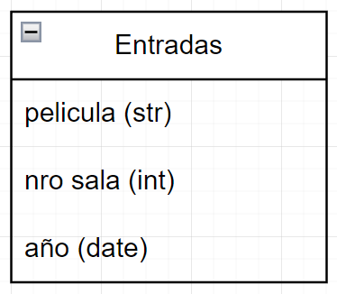

# TP-G1-Programacion-I
**El TPO reemplaza al segundo parcial en el curso regular de Programacion I**
- **Fecha limite de entrega:** 12/11/23
- **Fecha de exposicion y defensa:** 13/11/23
- **Formato de entrega:** a través de tareas de Microsoft Teams. Entrega un integrante del grupo.
    > **No se permiten otros medios de entrega. En caso de hacerlo se considerara no entregado**
- **Desarollo:** Grupal, utilizando los mismos gutlpos de trabajo en los que habitualmente se desarrolla la ejercitacion. No se admitiran los trabajos individuales, ya que un de los objetivos es fomentar el trabajo en equipo

- **Material a entregar:** Archivo python (.py). Ejemplo: TPO_Grupo7.py. Tambien debera entregarse cualquer codigo adicional o archivo de datos que sea necesario para la correcta ejecucion del programa.

- **Criterio de evaluación:** Se evaluaran los siguientes aspectos
    - Fidelidad respecto al enunciado
    - Funcionamiento del programa
    - Tecnicas de Programación
    - Prolijidad del codigo y de la interfaz de usuario
    - La clasificacion final recibida por cada integrante dependerá no solo del trabajo presentado sino también de la defensa ejercida.
    - El desarrollo podrá llevarse a cabo durante el tiempo de clase dedicado a la ejercitacion o fuera del horario de la misma.

_ _ _

- **Objetivo:** El trabajo practico consistira en el desarrollo de un programa de python que respondera a la consigna indicada a continuacion. En el mimso debera aplicarse las tecnicas de programacion tratadas en la materia y detalladas mas abajo:
    - Funciones
    - Matrices
    - Cadenas de caracteres
    - Excepciones
    - Archivos
    - Recursividad
    - Tuplas, conjuntos y/o diccionarios (uno de los tres sera suficiente)
    > **Todos** estos temas tendran que ser incluidos en el programa. la ausencia de alguno de ellos reducirá significativamente la calificacion. Los temas podrán ser añadidos a medida que sean abordados en clase

**Nota:** No se permite el uso de modulos externos no tratados en clase como pygame, freegames, numpy, tkinter, etc. Sin embargo, los modulos time, os y colorama pueden ser utilizados si fuera necesario

**Exposición:** El dia de la exposición **todos los miembros del grupo* deberan participar de la defensa del trabajo presentado. Si algún integrante no participa de la misma se lo considerara ausente al segundo parcial y deberá recuperarlo en la fecha prevista para el recuperatorio. El recuperatorio consistira en un examen individual, sin relación con el TPO

## Consigna 🗒️
[Enunciado](consignas/enunciado.md)

## DER base de datos

## Archivos 📁
[Archivos](codigo)